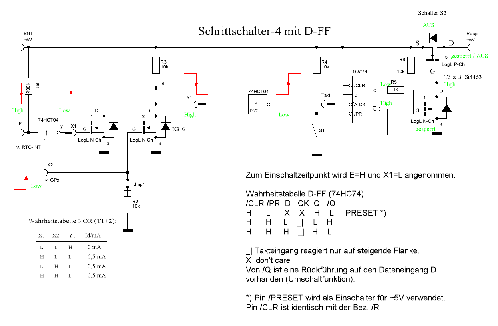
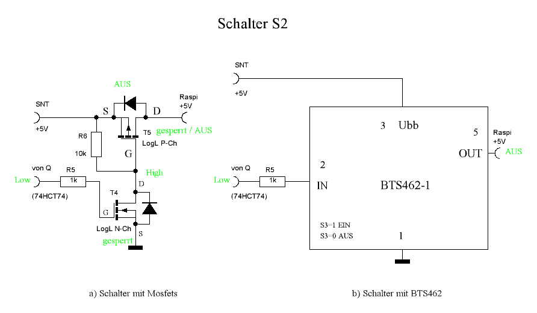
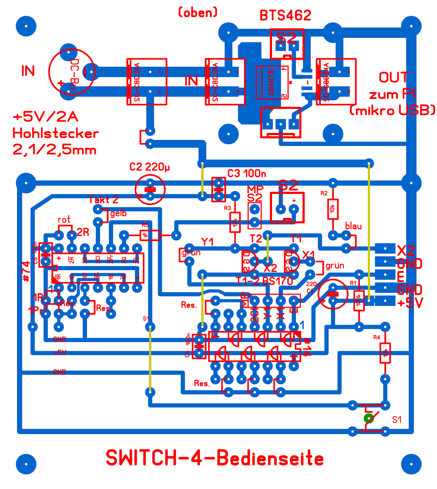
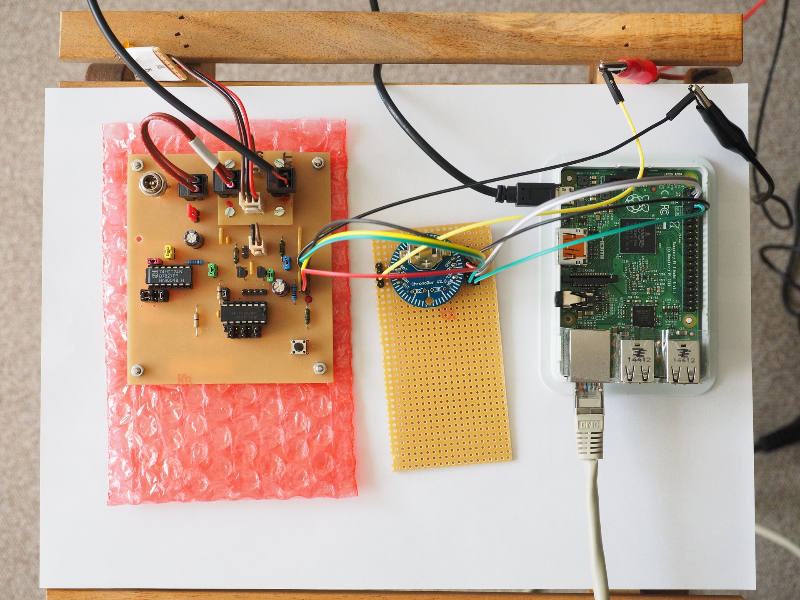

The Circuit
===========

The circuit is split in two parts: the first part implements the
switching logic:

whereas the second part implements the actual power-switch for the Pi:

Note that this graphic documents two possible implementation variants. The
second part connects to first part on the right side (labeled "zu S2").

We also provide a layout for the pcb (seen from above):

Wall-power supply is top-left, power to the Pi is top right. The pins on
the right side go to the RTC and the Pi. The following image shows
the circuit on the left, the RTC in the middle and the Pi on the right:

Please also have a look at additional files in the doc-directory: you
will find a parts-list in oocalc-format (German suppliers, but it should
get you going).
